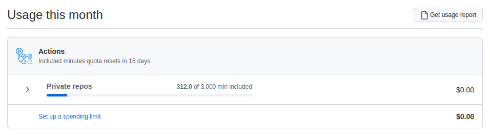
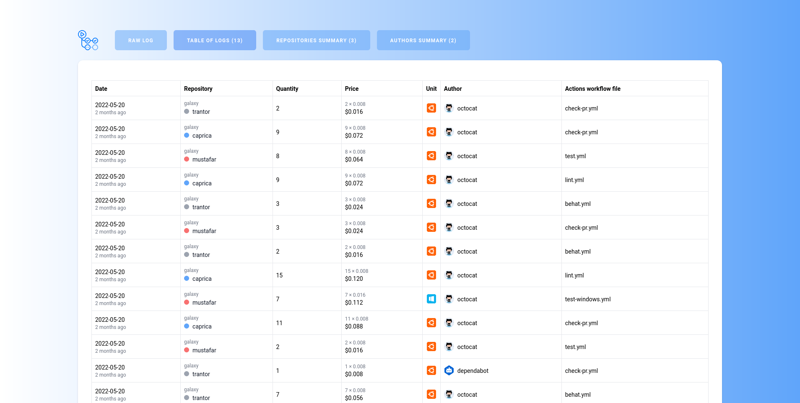

## GitHub Actions simple analyzer
> Created in the absence of a native GitHub solution to understand your organization's actions quotas. 

## Why?
This native solution is probably nice only for your accountants:



And this generated report is nice when it's a 10-rows long file or when you are a robot:

```csv
Date,Product,SKU,Quantity,Unit Type,Price Per Unit ($),Multiplier,Owner,Repository Slug,Username,Actions Workflow,Notes
2022-05-20,Actions,Compute - UBUNTU,2,minute,0.008,1.0,galaxy,trantor,octocat,.github/workflows/check-pr.yml,
2022-05-20,Actions,Compute - UBUNTU,9,minute,0.008,1.0,galaxy,caprica,octocat,.github/workflows/check-pr.yml,
2022-05-20,Actions,Compute - UBUNTU,8,minute,0.008,1.0,galaxy,mustafar,octocat,.github/workflows/test.yml,
2022-05-20,Actions,Compute - UBUNTU,9,minute,0.008,1.0,galaxy,caprica,octocat,.github/workflows/lint.yml,
2022-05-20,Actions,Compute - UBUNTU,3,minute,0.008,1.0,galaxy,trantor,octocat,.github/workflows/behat.yml,
2022-05-20,Actions,Compute - UBUNTU,3,minute,0.008,1.0,galaxy,mustafar,octocat,.github/workflows/check-pr.yml,
2022-05-20,Actions,Compute - UBUNTU,2,minute,0.008,1.0,galaxy,trantor,octocat,.github/workflows/behat.yml,
2022-05-20,Actions,Compute - UBUNTU,15,minute,0.008,1.0,galaxy,caprica,octocat,.github/workflows/lint.yml,
2022-05-20,Actions,Compute - WINDOWS,7,minute,0.016,1.0,galaxy,mustafar,octocat,.github/workflows/test-windows.yml,
2022-05-20,Actions,Compute - UBUNTU,11,minute,0.008,1.0,galaxy,caprica,octocat,.github/workflows/check-pr.yml,
2022-05-20,Actions,Compute - UBUNTU,2,minute,0.008,1.0,galaxy,mustafar,octocat,.github/workflows/test.yml,
2022-05-20,Actions,Compute - UBUNTU,1,minute,0.008,1.0,galaxy,trantor,dependabot[bot],.github/workflows/check-pr.yml,
2022-05-20,Actions,Compute - UBUNTU,7,minute,0.008,1.0,galaxy,trantor,octocat,.github/workflows/behat.yml,
```

This really simple Vue.js application transforms your data from raw CSV to sortable and colorful tables with indicators which repositories and developers are responsible for your organization's actions. All data stays in your browser as the application doesn't have any backend or even external calls except fetching a few JavaScript libraries and CSS stylesheets.



You can download your usage report here: https://github.com/organizations/<your-organization-name>/settings/billing
